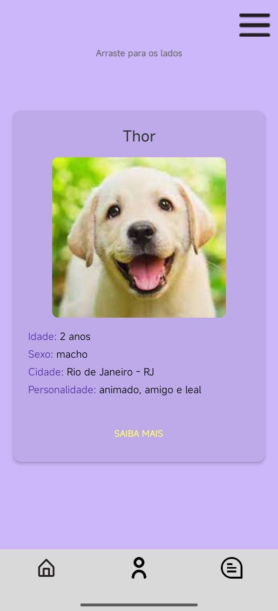
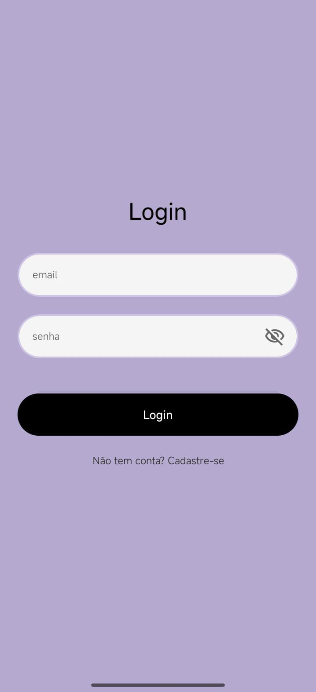
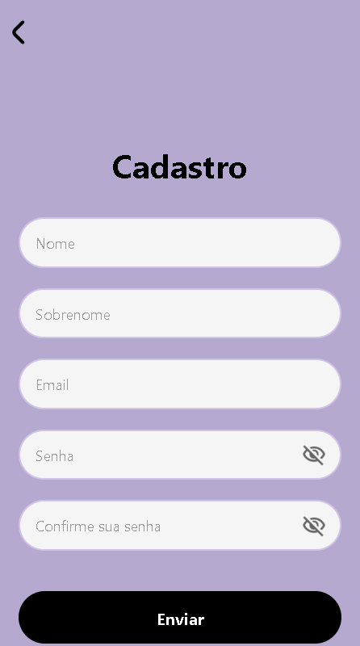
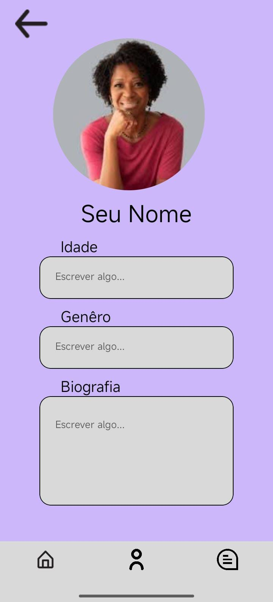
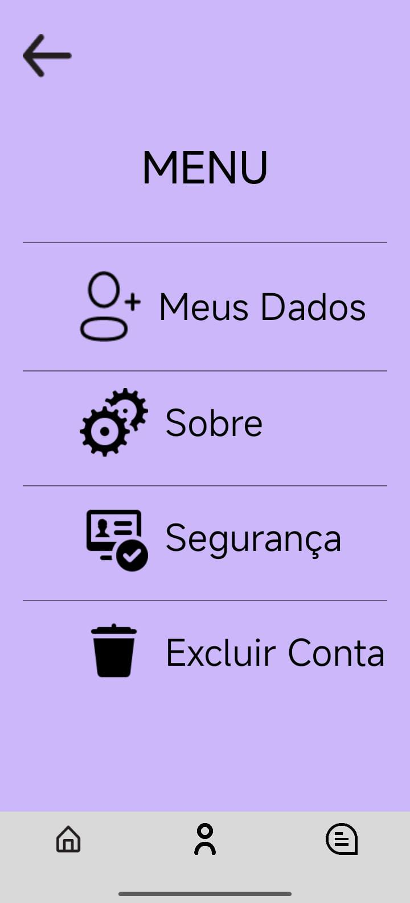

# 🐾 Pet Match

**Pet Match** é uma plataforma móvel completa, desenvolvida para conectar, de forma responsável e eficiente, pessoas que desejam doar animais de estimação com lares amorosos em busca de um novo membro da família. Nosso objetivo é simplificar o processo de adoção, promovendo matches baseados em compatibilidade.

[](https://github.com/Andersonndiass/Pet-Match)
[](https://github.com/Andersonndiass/Pet-Match)
[](https://reactnative.dev/)
[](https://nodejs.org/en/)

## ✨ Funcionalidades

O Pet Match oferece um conjunto robusto de recursos para otimizar a experiência de doação e adoção:

* **Sistema de Match:** Interface de deslize (*swipe*) intuitiva para que os utilizadores descubram animais compatíveis.
* **Perfis Detalhados de Pets:** Criação de perfis completos, incluindo fotos, histórico de saúde, temperamento e necessidades especiais.
* **Gestão de Doadores:** Interface dedicada para que abrigos e cuidadores gerenciem seus animais disponíveis para adoção.
* **Filtros Inteligentes:** Opções avançadas de pesquisa por espécie, porte, idade e localização.
* **Comunicação Direta:** para facilitar a comunicação entre as partes interessadas.

---

## 📱 Capturas de Tela

Uma visão do design e da experiência do utilizador da aplicação.

| Tela Inicial | Login | Cadastro | Perfil | Menu |
| :---: | :---: | :---: | :---: | :---: |
|  |  |  |  |  |

---

## 🛠 Tecnologias Utilizadas

Este projeto é uma aplicação *full-stack* desenvolvida com as seguintes tecnologias:

### 🌐 Frontend (Mobile)
* **React Native:** Framework para construção de interfaces nativas.
* **React Navigation:** Gerenciamento da navegação entre as telas.
### 💾 Backend (API)
* **Node.js:** Ambiente de execução principal para o servidor.
* **Banco de Dados & Autenticação:** **Supabase** (Baseado em PostgreSQL, oferecendo soluções de DB e Auth como serviço).
### 🎨 UI/UX & Design
* **Figma:** Ferramenta utilizada para prototipagem e design da interface do utilizador.

---

## 📦 Como Executar o Projeto

Como o Pet Match foi construído com o Expo, a forma mais rápida de visualizar e interagir com o projeto é diretamente pelo navegador, sem necessidade de instalação local complexa.

### Pré-requisitos
* Um navegador web moderno (Chrome, Firefox, Edge, Safari, Brave).
* A aplicação **Expo Go** instalada no seu dispositivo móvel (opcional, para testes no hardware real).

### Acesso via Expo Snack

1.  **Acesse o Link:**
    ```
    [https://snack.expo.dev/@francisco0/petmatch]
    ```

2.  **Visualização:**
    * O aplicativo será executado automaticamente no simulador de celular exibido no painel central da página.
    * Para testar em um dispositivo físico, use a aba **"My Device"** (ou escaneie o QR Code) e abra no seu celular através do app **Expo Go**.

* *Em breve o tutorial de instalação*
---

## 👤 Autor

* **Desenvolvedor Principal:** Francisco Anderson
* **GitHub:** [Andersonndiass](https://github.com/Andersonndiass)
* **Linkedin:** [Anderson Dias](https://www.linkedin.com/in/andersonndiass/)

---
