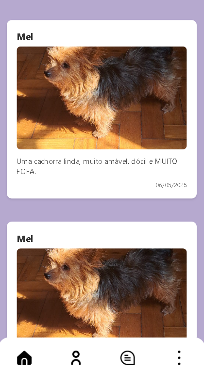
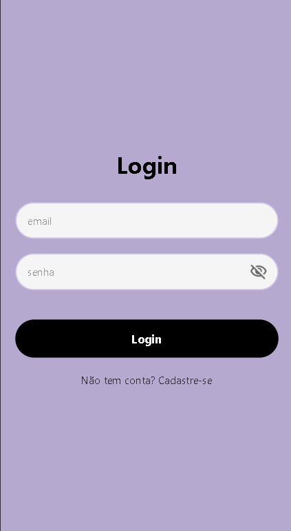

# 🐾 Pet Match

O Pet Match é um aplicativo que facilita as pessoas que desejam doar pets e aquelas que buscam adotar um animal de estimação de forma responsável.

## 📱 Capturas de Tela

| Tela Inicial | Login | Cad |
|--------------|------------------|----------|
|  |  |  |

## 🛠 Tecnologias Utilizadas

### Frontend
- React Native
- React Navigation

### Backend
- Node.js

### UI/UX
- Figma 

## 📦 Como Executar o Projeto

### Pré-requisitos
- Node.js
- Yarn ou npm
- Expo.dev

### Instalação

1. Clone o repositório:
```bash
git clone https://github.com/Andersonndiass/Pet-Match
cd petmatch